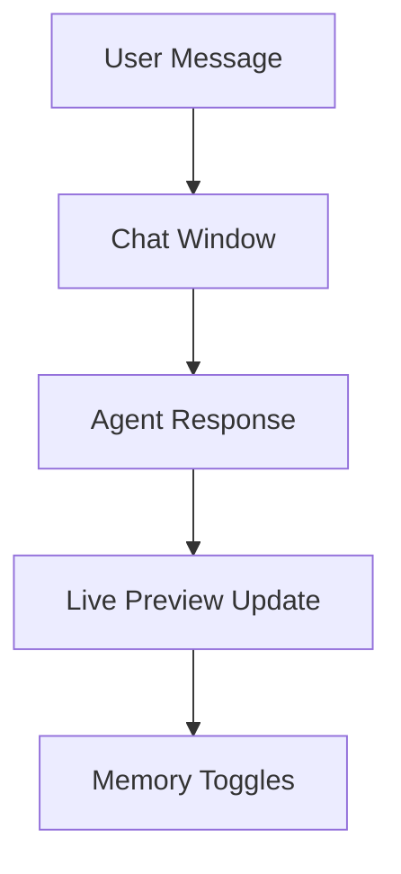
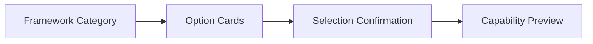
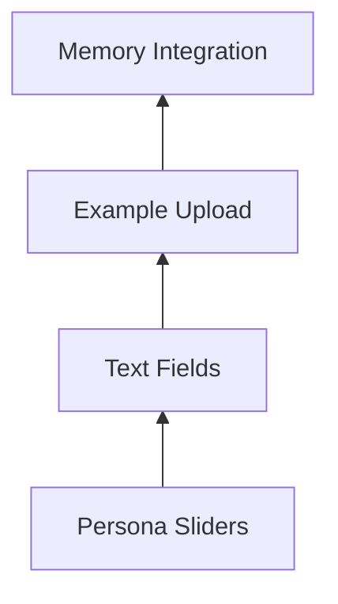
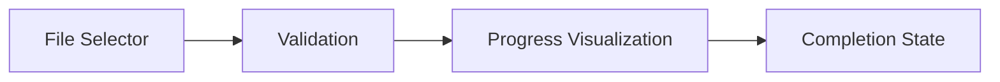

# Agent Creation Interface Design Plan

## 1. No-Code Chat Interface

### Design Elements

- **Chat Window Layout**:
  - Gloss Black background with Digital Purple accents
  - Message bubbles: User (Electric Gold), Agent (Digital Purple)
  - Typing indicators with Cyber Cyan pulse animation

- **Dynamic Preview**:
  - 3D agent model that reacts to conversation
  - Real-time parameter adjustments visible
  - Matrix-style data streams for memory operations

## 2. Framework & LLM Selection

### Visual Design

- **Option Cards**:
  - Gloss Black cards with Digital Purple borders
  - Hover effects: 20% glow increase + pulse
  - Selected state: Electric Gold highlight

- **Thematic Visuals**:
  - Each framework has unique cyberpunk-inspired icon
  - Performance metrics displayed as "holographic" readouts

## 3. Persona Integration

### Interface Components

- **Slider Controls**:
  - Digital Purple track with Electric Gold handle
  - Cyber Cyan glow on active state
  - Real-time avatar updates

- **Memory Features**:
  - Nyx-Harmonia toggle with matrix-style animation
  - Memory strength visualized as "neural network"

## 4. Skill & Training Data

### Upload Flow

- **Upload Interface**:
  - Gloss Black drop zone with Digital Purple border
  - Cyber Cyan scanline animation during upload
  - Error states: Alert Red shake effect

- **Progress Indicators**:
  - Segmented glow bar (Digital Purple → Electric Gold)
  - Binary stream animation during processing

## Technical Requirements

1. **Component Library**:
   - React + TypeScript
   - Styled-components for theme management
   - Framer Motion for animations

2. **Performance**:
   - 60fps target for all animations
   - Lazy load 3D elements
   - Respect prefers-reduced-motion

3. **Accessibility**:
   - ARIA labels for all interactive elements
   - Keyboard navigable interface
   - High contrast mode support

## Implementation Phases

1. **Phase 1 (2 weeks)**:
   - Base components and theme system
   - Core chat interface functionality

2. **Phase 2 (3 weeks)**:
   - Framework selection interface
   - Persona integration controls

3. **Phase 3 (2 weeks)**:
   - Training data upload
   - Final polish and animations