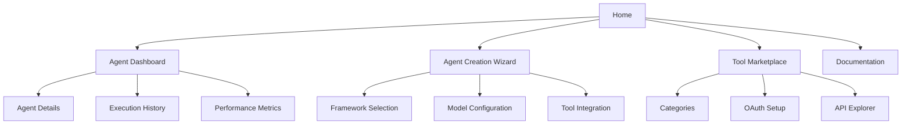
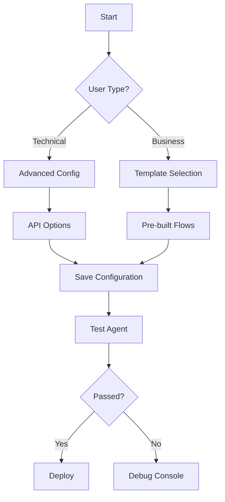
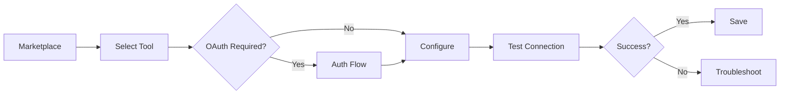

# AI Agent Platform - Information Architecture

## 1. Sitemap Structure



## 2. Key User Flows

### Agent Creation Flow


### Tool Integration Flow


## 3. Wireframe Concepts

### Homepage
```
[ Header: Platform Logo + Main Nav ]
[ Hero: Cyberpunk-styled value prop ]
[ Quick Start CTA (glowing border) ]
[ Framework Comparison (matrix-style table) ]
[ Footer: Secondary Links ]
```

### Agent Dashboard
```
[ Left: Agent List (neon-accented cards) ]
[ Main: Activity Stream (terminal-style) ]
[ Right: Quick Actions (glowing buttons) ]
[ Bottom: Metrics (data visualization) ]
```

## 4. Design Decisions

1. **Navigation Architecture**:
   - Primary nav focused on core workflows
   - Contextual secondary nav for agent management
   - Persistent help/documentation access

2. **User Experience**:
   - Branching paths based on technical level
   - Progressive disclosure of complexity
   - Consistent cyberpunk visual language

3. **Technical Considerations**:
   - Aligns with existing backend services
   - Supports all three user personas
   - Adaptable for future feature expansion