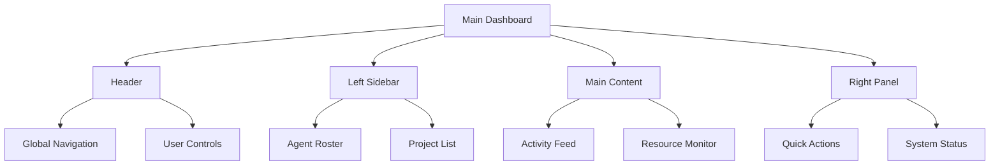
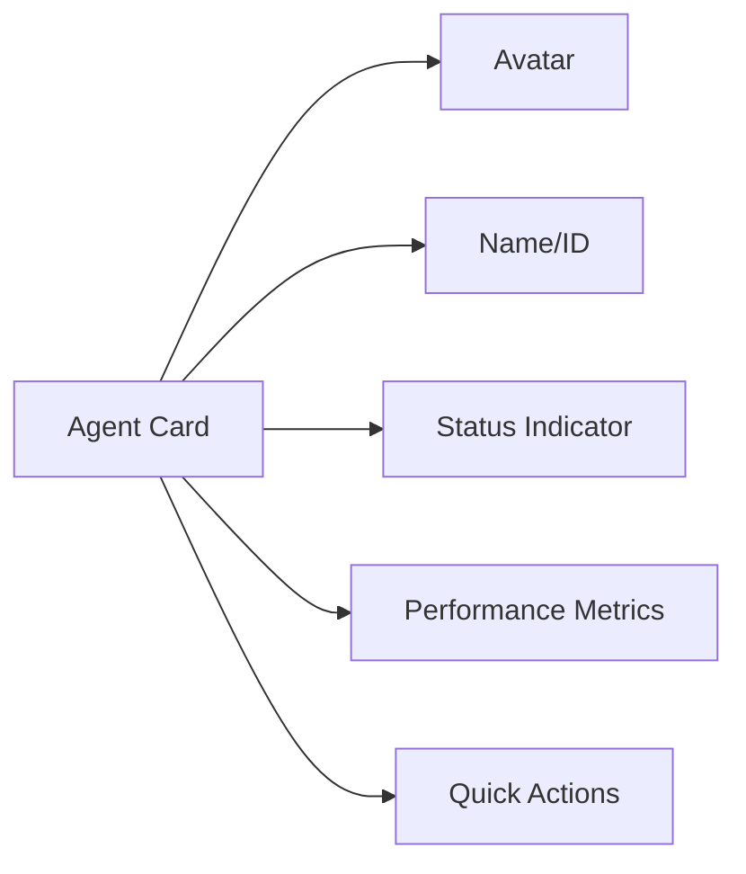
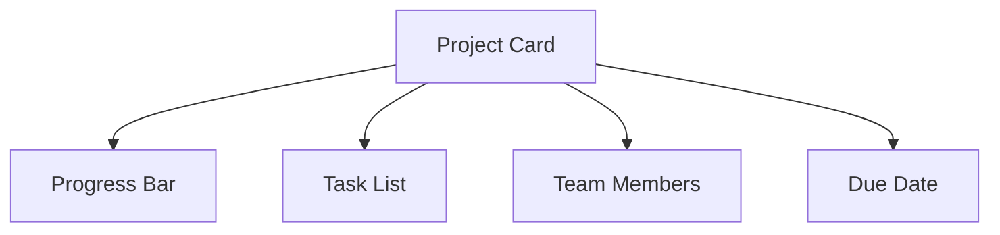
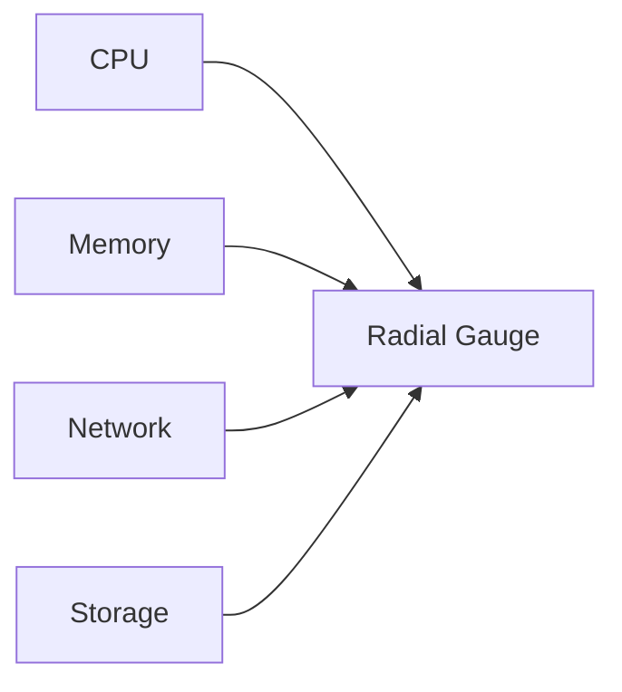

# AI Agent Platform - Dashboard Design Specification

## 1. Layout Architecture

## 2. Section Specifications

### Agent Roster/Inventory

### Project Management

### Resource Monitor

## 3. Visual Hierarchy

| Element | Visual Treatment |
|---------|------------------|
| Primary Actions | Digital Purple buttons with pulse glow |
| Secondary Actions | Electric Gold outline buttons |
| Status Indicators | Cyber Cyan animated pulses |
| Critical Alerts | Alert Red with shake animation |
| Data Visualizations | Matrix Green with binary stream effects |

## 4. Thematic Elements

### Holographic Displays
- Floating agent status panels with parallax effect
- Transparent overlays with grid patterns
- Data streams visualized as binary code flows

### Terminal Elements
- Command input with typewriter animation
- Output logs with scanline effects
- Interactive prompt with Cyber Cyan cursor

## 5. Technical Requirements

1. **Frontend Components**:
   - React + TypeScript
   - Styled-components for theme management
   - Framer Motion for animations
   - Chart.js for data visualization

2. **Backend Integration**:
   - Real-time updates via WebSocket
   - Agent status from `/backend/routes/monitoring.py`
   - Project data from `/backend/routes/tasks.py`

3. **Performance**:
   - Virtual scrolling for long lists
   - Debounced updates for resource monitors
   - 60fps animation target

## 6. Implementation Roadmap

1. **Phase 1 (2 weeks)**:
   - Base layout and navigation
   - Agent roster components
   - Basic activity feed

2. **Phase 2 (3 weeks)**:
   - Resource monitoring dashboards
   - Project management interface
   - Thematic elements implementation

3. **Phase 3 (1 week)**:
   - Performance optimizations
   - Accessibility enhancements
   - Final polish and animations